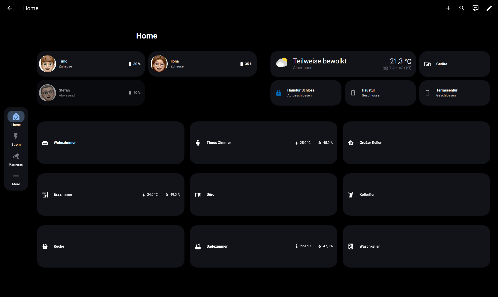

# Panel Strategy

[](https://github.com/hacs/integration)

A Home Assistant Lovelace [dashboard strategy](https://www.home-assistant.io/dashboards/strategies/) (`custom:panel-strategy`) that generates a full tablet/panel-style dashboard — a home screen, one subview per room, device-category pages, and a cameras tab — directly from your area/entity/device registries. Add a new room or a new light in Home Assistant and it just shows up; no dashboard editing required.



## Why

The usual way to build this kind of dashboard is a hand-written view per room plus a hand-written view per device category, each with its own `auto-entities` filter and its own `area:` slug. Every new room needs a new view written from scratch, and every new device needs the right label/area already set up somewhere or it silently doesn't show up. This strategy replaces all of that with a handful of rules evaluated fresh every time the dashboard loads.

## What it generates

- **Home** — a fixed layout: weather, a "Devices" button, one card per configured lock/sensor across all your `doors` entries, person cards, and a grid of room cards (one per visible area, tap to open that room).
- **One subview per room** (`/<dashboard>/room_<area_id>`) — that area's entities, grouped by your `device_categories`.
- **A device picker** (`/<dashboard>/devices`) and **one view per category** (`/<dashboard>/devices_<key>`) — every matching entity across the whole house, grouped by area.
- **A Kameras tab** — auto-discovered, only generated if you have any `camera.*` entities at all. No config needed beyond an optional stream provider.
- **Any fully custom extra views you define** (e.g. a power/energy dashboard) — see [Custom extra views](#custom-extra-views-configviewsextra).

Everything renders as [Bubble Card](https://github.com/Clooos/Bubble-Card) buttons, styled consistently across the whole dashboard.

## Requirements

- [Bubble Card](https://github.com/Clooos/Bubble-Card) — every generated button is a `custom:bubble-card`. Required.
- [Auto Area Device Card](https://github.com/Todt40/auto-area-device-card) — used by the device-category pages. Only required if you configure `device_categories`.
- [navbar-card](https://github.com/joseluis9595/lovelace-navbar-card) — only required if you configure `navbar`. This strategy passes your navbar config through as-is and additionally injects a back button that appears only on subviews (see [Navbar & back button](#navbar--back-button)).
- [advanced-camera-card](https://github.com/dermotduffy/advanced-camera-card) — only required if you have camera entities (the Kameras tab uses it).
- Anything you reference yourself in `views.extra` (see below) — the strategy doesn't require any of those, they're entirely up to you.

## Installation

### HACS (recommended)

1. In HACS, go to the three-dot menu (top right) → **Custom repositories**, add this repository's URL with category **Dashboard**.
2. Search for "Panel Strategy" in HACS and install it.
3. HACS adds the Lovelace resource automatically. Reload your browser (clear cache if it doesn't show up), then create a dashboard and set the strategy — see [Quick start](#quick-start) below.

### Manual

1. Copy every `panel-strategy*.js` file in this repo into `config/www/panel-strategy/` on your Home Assistant instance (same folder — they load each other as siblings).
2. Add it as a Lovelace resource (Settings → Dashboards → ⋮ → Resources → Add Resource):
   ```
   URL: /local/panel-strategy/panel-strategy.js?v=1
   Type: JavaScript Module
   ```
   The `?v=1` is a manual cache-buster — bump it (`?v=2`, `?v=3`, ...) whenever you update any of the files, so browsers that already cached the old version pick up the change.
3. Create a new dashboard (or edit an existing one), switch it to YAML mode, and set:
   ```yaml
   strategy:
     type: custom:panel-strategy
     weather_entity: weather.home
   ```
   That alone already gives you a working Home view (just weather + whatever rooms/persons you add below).

## Quick start

```yaml
strategy:
  type: custom:panel-strategy
  weather_entity: weather.home
  weather_name: My House
  persons:
    - entity: person.alice
      name: Alice
      battery_level: sensor.alices_phone_battery_level
  doors:
    - lock_entity: lock.front_door
      sensor_entity: binary_sensor.front_door_contact
  device_categories:
    - key: lights
      name: Lights
      icon: mdi:lamp-outline
      domain: light
    - key: switches
      name: Switches
      icon: mdi:power-socket-de
      domain: switch
    - key: other
      name: Other
      icon: mdi:dots-horizontal
```

Load the dashboard and you should see a Home view with weather, your person card(s), a front-door lock+sensor pair, and one room card per area Home Assistant knows about that's assigned to a floor. Tapping a room opens its subview, grouped into "Lights" / "Switches" / "Other". Tapping "Devices" opens the same three categories, but house-wide instead of per room.

## Configuration reference

All of these go under `strategy:` (i.e. `type: custom:panel-strategy` is a sibling key, not a parent of the rest).

| Key | Default | Description |
|---|---|---|
| `theme` | `null` | Theme applied to every generated view. |
| `home_heading` | `'Home'` | Heading and view title for the Home view. |
| `devices_heading` | `'Geräte'` | Heading and view title for the devices picker. Defaults to German — override this if you want an English (or any other) label. |
| `weather_entity` | `null` | A `weather.*` entity. Home view has no weather card if unset. |
| `weather_name` | `null` | Overrides the weather card's title. |
| `weather_secondary_info_attribute` | `null` | Passed to the weather card's `secondary_info_attribute`. |
| `weather_forecast_type` | `'daily'` | Passed to the weather card's `forecast_type` — whatever your weather integration supports (check the card's own editor for the valid options, typically `'daily'` or `'hourly'`). |
| `weather_show_forecast` | `false` | Shows a forecast strip under the current conditions. Off by default to keep the card compact. |
| `person_away_dimming` | `true` | Dims a person's card whenever their state isn't exactly `home` (a named zone counts as away too). Set `false` to disable. |
| `doors` | `[]` | See [Doors](#doors) below. |
| `persons` | `[]` | See [Persons](#persons) below. |
| `device_categories` | `[]` | See [Device categories](#device-categories) below. |
| `areas.hidden_labels` | `['hidden']` | Areas carrying any of these labels are skipped everywhere (Home room grid, room subviews, device pages). |
| `areas.order` | `[]` | `area_id`s shown first, in this order, on the Home room grid. Anything not listed falls back to floor level, then name. |
| `cameras.live_provider` | `'go2rtc'` | Passed to every discovered camera on the Kameras tab. |
| `room_columns` | `3` | Room-card columns per screenful on the Home view (extra rooms page off-screen via horizontal swipe). |
| `layout.*` | — | Sizing/spacing knobs. See [Layout](#layout) below. |
| `navbar` | `null` | A [navbar-card](https://github.com/joseluis9595/lovelace-navbar-card) config, passed straight through onto every generated view. See below. |
| `hide_native_tabs` | `true` | Only relevant when `navbar` is set — hides HA's own top view-tab strip on Home/Kameras/`views.extra` when true. See [Navbar & back button](#navbar--back-button). |
| `views.home.sections` | `[]` | Escape hatch: extra hand-written cards appended below the room grid on Home. Only `{type: 'cards', cards: [...]}` entries are used. |
| `views.extra` | `[]` | Fully custom extra top-level views. See [Custom extra views](#custom-extra-views-configviewsextra). |

None of the entity fields above (`doors[].lock_entity`/`sensor_entity`, `persons[].entity`, `persons[].battery_level`) check the entity's domain — they just render a bubble-card button bound to whatever entity ID you give them, so use whatever entity actually reflects the thing you want shown, regardless of domain.

Room cards additionally show temperature/humidity next to the room name, but only if the *area itself* has those set (Settings → Areas → open an area → Sensors) — not something this strategy config controls. Areas with neither configured just show name + icon, no error.

### Doors

```yaml
doors:
  - lock_entity: lock.front_door
    sensor_entity: binary_sensor.front_door_contact
  - lock_entity: binary_sensor.side_door_lock   # some lock integrations only expose
    sensor_entity: binary_sensor.side_door_contact  # a binary_sensor, not a lock.* entity — that's fine
    lock_name: Side Door
    lock_icon: mdi:lock
    sensor_name: Side Door
    sensor_icon: mdi:door
```

Each entry can have a `lock_entity` and/or a `sensor_entity` — either can be left out. `lock_name`/`lock_icon`/`sensor_name`/`sensor_icon` are optional overrides for when the entity's own friendly name/icon isn't what you want shown (the common case: a lock exposed as a plain `binary_sensor` with no lock-shaped icon of its own, or a name you'd rather not rename in Home Assistant itself).

Every configured lock/sensor across every door becomes its own card in a 3-column grid on Home, in the order you listed them (lock before sensor, within each door). More than 3 cards wrap onto further rows of 3 rather than shrinking to fit — there's no config for a different column count here, since it's tuned to align with the weather/"Geräte" row above it.

If `doors` is empty, that row is simply omitted from Home.

### Persons

```yaml
persons:
  - entity: person.alice
    name: Alice
    battery_level: sensor.alices_phone_battery_level   # optional
```

One bubble-card per person, with a battery sub-button if `battery_level` is set. Cards are visually dimmed whenever the person's state isn't exactly `home` — including a named zone (e.g. "Work"), not just `not_home` — unless you set `person_away_dimming: false`.

### Device categories

Each entry:

```yaml
device_categories:
  - key: lights          # required — used in the URL path (/devices_lights) and internally
    name: Lights          # shown as the heading/tile label (falls back to key)
    icon: mdi:lamp-outline
    button_type: switch   # optional override — default: 'switch' for light/switch domains, 'state' otherwise
    domain: light          # match one domain...
    domains: [sensor, binary_sensor]        # ...or any of several
    device_class: door                       # match one device_class...
    device_classes: [door, window, opening]  # ...or any of several
    exclude_domains: [camera, automation]
    exclude_device_classes: [battery]
    exclude_platforms: [template, threshold] # entity registry `platform` — filters out
                                              # computed/helper entities, keeping only
                                              # real hardware sensors, say
```

**Order matters.** Every entity is assigned to the *first* category in your list whose filter matches it — not to every category that happens to match. This is what makes a broad catch-all category (no `domain`/`device_class` restriction at all) actually mean "everything no earlier category claimed" — put it last:

```yaml
device_categories:
  - key: lights
    domain: light
  - key: doors_windows
    domain: binary_sensor
    device_classes: [door, garage_door, window, opening]
  - key: other
    name: Other
    icon: mdi:dots-horizontal
    # no domain/device_class at all — catches whatever's left
```

Regardless of your filters, `event.*`/`notify.*` entities and a handful of infrastructure entities (browser_mod, zigbee2mqtt bridge, helper groups, hidden/disabled/config-category entities) are always excluded.

An entity that doesn't match *any* category simply doesn't show up anywhere (room subview or device page) — silently, no warning. If you want everything to be reachable somehow, end the list with a catch-all category as shown above; if you don't, that's an intentional filter, not a bug to chase.

An entity with no area assigned at all (directly, or via its device) is skipped the same way, category filters aside — assign it to an area first if it should show up.

If `device_categories` is empty, no "Devices" button/picker/category pages are generated at all — the Home view just omits that button.

### Layout

Every default here is tuned for a roughly 10" tablet. None of this changes what's shown, only how big/dense it renders — safe to leave alone unless something looks visibly too cramped, too spaced out, or clipped for your screen.

```yaml
layout:
  button_height: 90            # px — height of every standard button: doors,
                                # "Devices", category tiles, room-subview device buttons
  room_card_height: 150        # px — height of each Home room card
  room_grid_gap: 18            # px — gap between room cards on Home
  block_gap: 12                # px — gap between rows in Home's right-hand
                                # block (weather/devices/doors) and the persons grid
  devices_columns: 2           # columns in the devices-picker tile grid
  room_category_columns: 3     # max columns per category grid inside a room subview
  reserved_height: null        # px override — see below
```

Every field is independent and optional — set only the ones you actually want to change; anything you don't set keeps its default.

`reserved_height` is the one that isn't purely cosmetic: the Home view estimates how many room-card rows fit on screen by subtracting a fixed estimate of the chrome above the room grid (app bar, heading, top row, gap — 420px by default) from your browser's viewport height. That estimate was tuned for this strategy's own default heading size and a single-line `home_heading`. If you use a very long `home_heading` that wraps to two lines, a theme with noticeably larger heading text, or otherwise find the room grid clipped at the bottom or leaving an obviously empty row's worth of space, set `layout.reserved_height` to a larger or smaller number (in px) to correct it — there's no formula to compute the right value from your config, it's trial and error via a reload.

### Navbar & back button

```yaml
navbar:
  routes:
    - icon: mdi:home
      url: /my-dashboard/home
      label: Home
    - icon: mdi:flash
      url: /my-dashboard/strom
      label: Strom
```

`/my-dashboard` above is your dashboard's own URL path (Settings → Dashboards → your dashboard → the URL slug you gave it, e.g. `/lovelace-panel` or whatever you chose) — not a placeholder to leave as literal text, and not the same thing as a view's `path` (`home`, `strom`, ...). The two are joined together at request time, so the route's `url` needs both.

This is passed straight through to `custom:navbar-card` — anything [navbar-card](https://github.com/joseluis9595/lovelace-navbar-card) supports works here (layout, media_player, popups, ...). One thing is added automatically: a back-arrow route that's hidden everywhere except on a room subview, the devices picker/category pages, or the Kameras tab, and calls `navigate-back` on tap. You don't add it yourself — it's prepended to whatever routes you configure, on every generated view.

Views from `views.extra` (see below) are treated as top-level tabs like Home/Strom by default — no back button. If you'd rather have one of them behave like a subview instead (reached by drilling down from somewhere, not pinned in the navbar itself), set `back_button: true` on that entry and it's included in the same back-button visibility rule.

Whenever `navbar` is configured, Home Assistant's own built-in top view-tab strip (the row of icons HA shows natively above a multi-view dashboard) is trimmed down, since it would otherwise duplicate the custom navbar with an icon for literally every generated view. Two tiers:

- **Room subviews, the devices picker, and device category pages** are *always* hidden from that strip once a navbar exists — showing one native tab per room or category on top of your actual `navbar.routes` is never useful, so `hide_native_tabs` doesn't apply to these.
- **Home, Kameras, and plain `views.extra` entries** (real, singular top-level destinations, not one-per-room/category) are hidden from that strip only while `hide_native_tabs` stays at its default (`true`). Set `hide_native_tabs: false` to show these specific ones there too, alongside the custom navbar — a `views.extra` entry with `back_button: true` counts as a room/device-page-style drill-down instead, so it stays hidden either way.

Without a `navbar` configured at all, nothing is ever hidden — that native tab strip is then your only way to switch between views.

### Custom extra views (`config.views.extra`)

Some pages simply can't be auto-generated — there's no generic way to know which sensors on your particular install represent, say, a solar inverter's battery/grid/solar power, or which vehicle-tracking card you use. For that, `views.extra` lets you define any number of fully custom, hand-written views. Each one is wrapped in the same page shell (navbar included) every generated view uses — you just supply the `cards:` yourself, verbatim:

```yaml
views:
  extra:
    - title: Strom
      path: strom          # must match the `url` you gave this route in navbar.routes
      icon: mdi:flash
      cards:
        - type: custom:power-flow-card-plus
          entities:
            battery:
              entity: sensor.inverter_battery_power
              state_of_charge: sensor.inverter_battery_soc
            grid:
              entity: sensor.inverter_grid_power
            solar:
              entity: sensor.inverter_solar_power
            home:
              entity: sensor.inverter_home_power
        - type: gauge
          entity: sensor.inverter_battery_soc
          name: Battery
          min: 0
          max: 100
```

That's it — `path: strom` becomes `/<dashboard>/strom`, `title`/`icon` become the view's title/tab icon, and `cards` is passed through completely unmodified. Add as many entries to `views.extra` as you like (a Strom page, a vacuum page, anything), each with its own `title`/`path`/`icon`/`cards`. None of it is generated or interpreted by the strategy — if a card needs a custom integration (a specific inverter's cards, a vehicle-tracking card, whatever), install that separately, same as you would on any hand-written Lovelace view.

Each `path` needs to be unique across the whole dashboard — don't reuse `home`, `devices`, `kameras`, `devices_<key>` (any of your category keys), or `room_<area_id>` (any area ID), or your extra view will collide with a generated one.

Add `back_button: true` to an entry to show the auto back-arrow on it (see [Navbar & back button](#navbar--back-button)) instead of treating it as a top-level tab.

If you want your extra view's cards to visually match the rest of the dashboard (Bubble Card buttons, sized/spaced the same as everything else), use `type: custom:bubble-card` with `card_type: button` the same way the strategy's own generated cards do, and give it the same `styles:` string this strategy uses internally (see `withSize()`/`BASE_STYLES` in `panel-strategy-builders.js`):

```yaml
styles: |
  ha-ripple { display: none !important; }
  .scrolling-container span { animation: none !important; transform: none !important; white-space: normal !important; }
  :host { height: 90px; }
  ha-card { height: 100% !important; padding: 0 0 8px 0 !important; }
  .card-content { height: 100% !important; }
  .bubble-container { height: 90px !important; }
  .bubble-button { width: 100%; overflow: visible !important; }
  .bubble-name, .bubble-state, .bubble-sub-button-name {
    white-space: normal !important;
    overflow: visible !important;
    text-overflow: unset !important;
  }
```

This is entirely optional — plain, unstyled cards work fine too. If you reuse this snippet across several buttons in the same view, a YAML anchor (`styles: &my_button_styles |` on the first, `styles: *my_button_styles` on the rest) avoids repeating it.

## Limitations

- The Home view's room-grid row count is computed once from your browser's viewport height when the dashboard loads, not recalculated live — resize or rotate the screen and you'll need to reload the dashboard for the row count to adjust.
- Only entities assigned to an area that itself belongs to a floor are considered "real rooms" (Home grid, room subviews, and — via Auto Area Device Card's own `require_floor` option — device pages). Areas with no floor (e.g. a technical/organizational area) never show up as a room. If your dashboard comes up with no rooms at all, this is the first thing to check — Settings → Areas → Floors, and make sure each area you expect to see is assigned to one (older Home Assistant installs, from before floors existed, often have areas with none set).
- There's no built-in way to hide a single camera from the Kameras tab short of hiding or disabling it in Home Assistant's own entity settings — every non-excluded `camera.*` entity is included, with no per-camera opt-out in config.

## Issues

Found a bug or have a feature request? [Open an issue](https://github.com/Todt40/panel-strategy/issues).

## License

MIT
